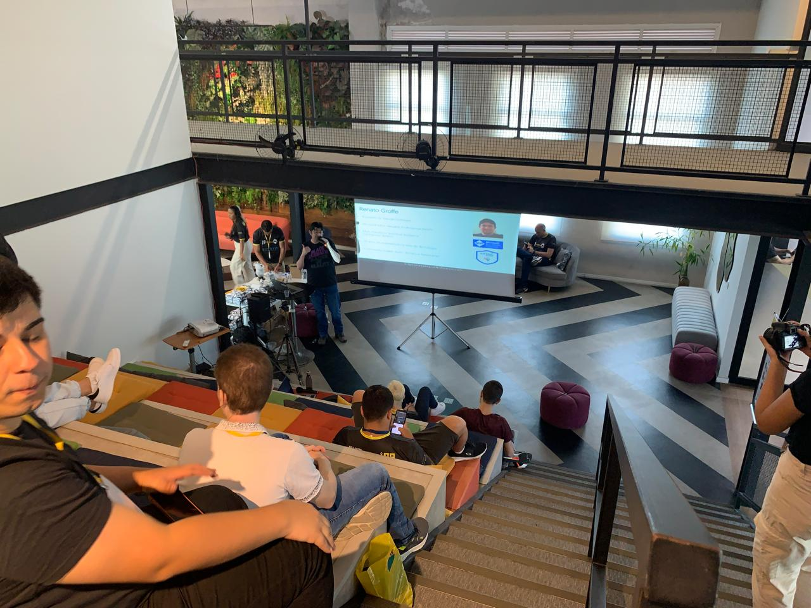

# kind_4alltests-2024-05
Exemplo de utilização de kind em testes com clusters Kubernetes localmente, além da automação de testes com esta tecnologia em um Pipeline do Azure DevOps e um workflow do GitHub Actions. Conteúdo apresentado no evento Referências 2024 da 4alltests em 18/05/2024 na cidade de São Paulo-SP.

Título da apresentação: **kind: Implementando e Automatizando Testes de Integração para Kubernetes**

Tecnologias utilizadas: **Kubernetes, kind, Docker, Linux, Azure DevOps, Azure Pipelines, GitHub GitHub Actions, MongoDB, .NET, ASP.NET Core, Postman, Newman, npm**

Número de participantes: **15 pessoas**

Link do evento: [**Site**](https://www.4alltests.com.br/referencias2024/)

Deixo aqui meus agradecimentos ao **Fábio Araújo** e à **Marcia Marrocos** por todo o apoio para que eu partipasse como palestrante do **Referências 2024**.

---

Outros prints podem ser encontrados neste [**diretório**](/img/).